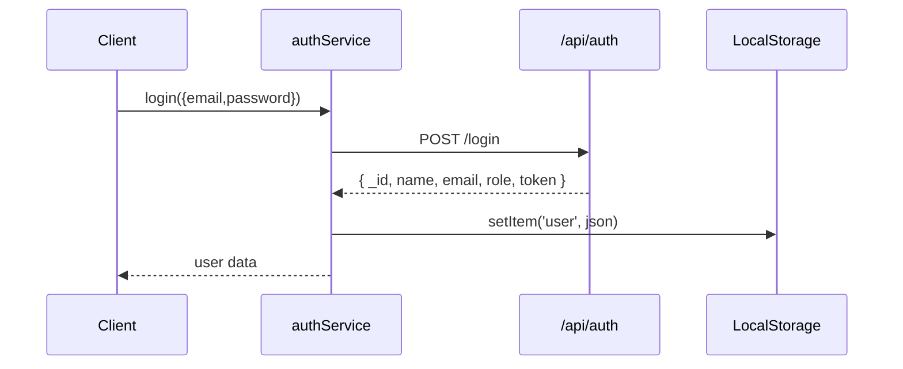
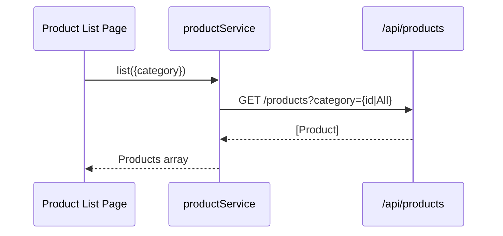
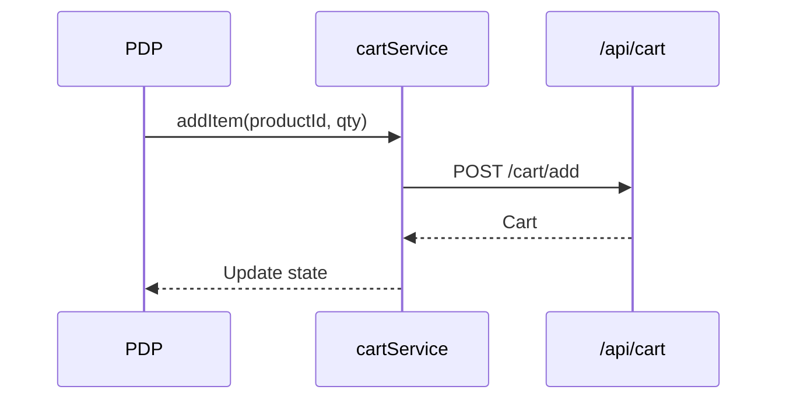
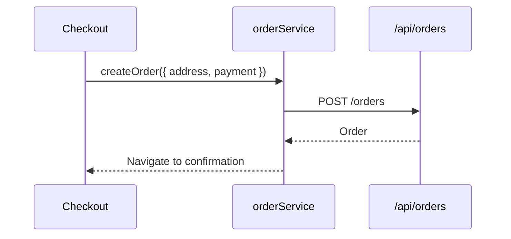
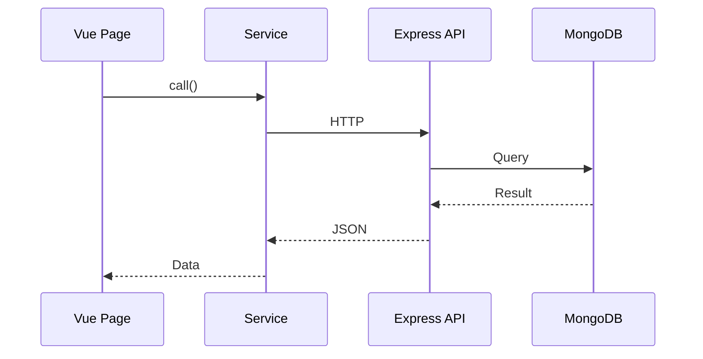
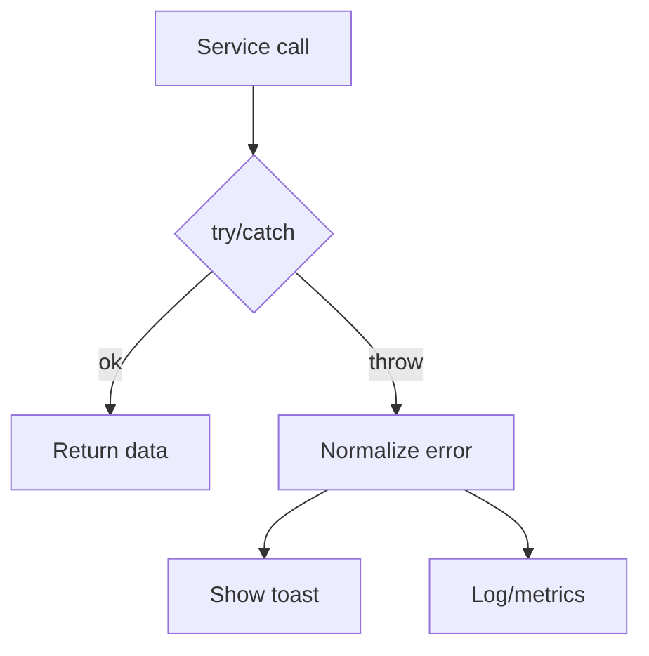

# Frontend Client Services — Developer Documentation

This document details each service in metainflu/frontend/client/src/services: what it does, how it’s used, request/response contracts, visual diagrams, improvement ideas, and edit examples. Services encapsulate all HTTP access to the backend API.

Tech stack
- HTTP: fetch (native). Recommended migration: axios for interceptors/retries
- Env: Vite env vars via import.meta.env.VITE_*
- Auth state: localStorage ('user')

Common patterns
- Base URL: VITE_API_BASE_URL || http://localhost:5000
- JSON headers: { 'Content-Type': 'application/json' }
- Bearer token header when user exists

Common helper (suggested)
```js
// src/services/http.js
const BASE = import.meta.env.VITE_API_BASE_URL || 'http://localhost:5000';
const build = (path) => `${BASE}/api${path}`;

export async function http(path, { method = 'GET', body, headers = {}, auth = true } = {}) {
  const user = JSON.parse(localStorage.getItem('user') || 'null');
  const token = user?.token;
  const h = { 'Content-Type': 'application/json', ...headers };
  if (auth && token) h.Authorization = `Bearer ${token}`;

  const res = await fetch(build(path), { method, headers: h, body: body ? JSON.stringify(body) : undefined });
  if (!res.ok) {
    let err;
    try { err = await res.json(); } catch { err = { message: res.statusText }; }
    throw new Error(err.message || `HTTP ${res.status}`);
  }
  if (res.status === 204) return null;
  return res.json();
}
```

Service overview
```mermaid
flowchart LR
  Pages --> AuthService
  Pages --> ProductService
  Pages --> CartService
  Pages --> OrderService
  Pages --> CategoryService
  Pages --> VendorService
  AuthService -->|Bearer token| LocalStorage[(localStorage)]
  AllServices -->|HTTP| API[/Express /api/*]
```

---
## authService.js
Purpose: Customer registration/login/logout. Persists user to localStorage under key 'user'.

Endpoints
- POST /api/auth/register
- POST /api/auth/login

Sequence: login


Current (fetch-based) simplified usage
```js
import auth from '@/services/authService';
const user = await auth.login({ email, password });
```

Edit example: add forgot/reset password
```js
const API_URL = (import.meta.env.VITE_API_BASE_URL || 'http://localhost:5000') + '/api/auth/';
export async function requestPassword(email){
  return fetch(API_URL + 'request-password', { method:'POST', headers:{'Content-Type':'application/json'}, body: JSON.stringify({ email }) }).then(r=>r.json());
}
export async function resetPassword(token, password){
  return fetch(API_URL + `reset-password/${token}`, { method:'POST', headers:{'Content-Type':'application/json'}, body: JSON.stringify({ password }) }).then(r=>r.json());
}
```

Improvements
- Use axios + interceptors; unify error handling
- Store only token in storage; cache user separately to reduce exposure
- Prefer HttpOnly cookies (requires backend change)
- Add typed response models (with TS) or JSDoc typedefs

---
## productService.js
Purpose: Product browse and detail.

Endpoints
- GET /api/products?category=All|<id>
- GET /api/products/:id

Sequence: list products with category filter


Example API contract
```ts
// Product (subset)
interface Product {
  _id: string;
  name: string;
  images?: { url: string; altText?: string }[];
  categories?: { _id: string; name: string }[];
  variants?: { sku: string; price: number; stock: number }[];
}
```

Edit example: add pagination and search
```js
export async function list({ category='All', page=1, limit=20, q='' }={}){
  const params = new URLSearchParams({ category, page, limit, q }).toString();
  const res = await fetch(`/api/products?${params}`);
  if(!res.ok) throw new Error('Failed to load products');
  return res.json();
}
```

Improvements
- Add caching (in-memory or SWR-style) for category lists
- Support abort signals for rapid filter changes
- Select only fields needed (backend support)

---
## cartService.js
Purpose: Manage shopping cart lifecycle.

Typical endpoints (depending on backend routes)
- GET /api/cart
- POST /api/cart/add
- PUT /api/cart/update/:itemId
- DELETE /api/cart/remove/:itemId
- DELETE /api/cart (clear)

Flow: add to cart


Edit examples
```js
import { http } from './http';
export const getCart = () => http('/cart');
export const addItem = (productId, quantity=1, attrs={}) => http('/cart/add', { method:'POST', body:{ productId, quantity, ...attrs } });
export const updateItem = (itemId, patch) => http(`/cart/update/${itemId}`, { method:'PUT', body: patch });
export const removeItem = (itemId) => http(`/cart/remove/${itemId}`, { method:'DELETE' });
export const clearCart = () => http('/cart', { method:'DELETE' });
```

Improvements
- Mirror server cart in Pinia for instant UI updates
- Optimistic updates with rollback on error
- Persist local cart for guests, merge on login

---
## orderService.js
Purpose: Create orders and query order history.

Endpoints
- POST /api/orders
- GET /api/orders/myorders
- GET /api/orders/:id
- PUT /api/orders/:id/pay

Flow: checkout → create order


Edit examples
```js
import { http } from './http';
export const createOrder = (payload) => http('/orders', { method:'POST', body: payload });
export const myOrders = () => http('/orders/myorders');
export const getOrder = (id) => http(`/orders/${id}`);
export const payOrder = (id, payment) => http(`/orders/${id}/pay`, { method:'PUT', body: payment });
```

Improvements
- Ensure price/total display uses server-confirmed amounts
- Add retry for idempotent fetches; never retry payments without idempotency keys

---
## categoryService.js
Purpose: Fetch categories for filtering and forms.

Endpoint
- GET /api/categories

Diagram


Example
```js
import { http } from './http';
export const listCategories = () => http('/categories', { auth: false });
```

Improvements
- Cache categories in memory (Pinia) and refresh periodically

---
## vendorService.js
Purpose: Storefront-side vendor interactions (if available to customers), or shared vendor info.

Possible endpoints
- GET /api/vendor/profile/:id
- GET /api/vendor/products/:vendorId

Diagram


Example
```js
import { http } from './http';
export const getVendorProfile = (id) => http(`/vendor/profile/${id}`);
export const getVendorProducts = (vendorId, params={}) => {
  const qs = new URLSearchParams(params).toString();
  return http(`/vendor/products/${vendorId}?${qs}`);
};
```

Improvements
- Enforce role checks server-side; restrict vendor-only data

---
## influencerService.js (legacy/optional)
Purpose: Leftover integration stubs for influencer features.

Action
- If unused, deprecate and remove to reduce bundle size and complexity.

---
## sequenceDiagram.md
Purpose: Developer note for API flow visualization. Keep it aligned with code.

---
## Cross-cutting visualizations

End-to-end page → service → API


Error handling flow


---
## How to improve services (summary)
- Introduce http.js wrapper (or axios) with:
  - Base URL handling
  - Authorization header injection
  - JSON parsing & error normalization
  - 401 interceptor to logout/redirect
  - Support AbortController for cancellation
- Add TypeScript types or JSDoc typedefs
- Co-locate service tests (unit with MSW or fetch-mock)
- Add idempotency for payment/checkout flows

---
## Editing guide (recipes)

Add a new service file (wishlistService.js)
```js
// src/services/wishlistService.js
import { http } from './http';
export const list = () => http('/wishlist');
export const add = (productId) => http('/wishlist', { method:'POST', body: { productId } });
export const remove = (productId) => http(`/wishlist/${productId}`, { method:'DELETE' });
```

Consume in a page
```vue
<script setup>
import { ref, onMounted } from 'vue';
import * as wishlist from '@/services/wishlistService';
const items = ref([]);

onMounted(async ()=>{ items.value = await wishlist.list(); });
</script>
```

Testing with MSW (outline)
```js
import { setupServer } from 'msw/node';
import { rest } from 'msw';
import { list } from '@/services/wishlistService';

const server = setupServer(
  rest.get('http://localhost:5000/api/wishlist', (req, res, ctx) => {
    return res(ctx.json([{ _id:'1', name:'Sample' }]));
  })
);

beforeAll(()=>server.listen());
afterEach(()=>server.resetHandlers());
afterAll(()=>server.close());

test('list wishlist', async () => {
  const data = await list();
  expect(data).toHaveLength(1);
});
```

---
## Security notes
- Consider moving from localStorage token to HttpOnly cookie + CSRF token
- Redact sensitive error messages
- Never expose admin/vendor-only endpoints in the client app

---
Last updated: Oct 2025
